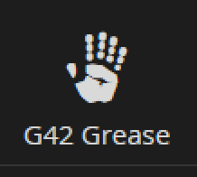

# G42.UmbracoGrease

Grease is the stuff that's too dirty for the Umbraco core, but adds functionality that lots of ordinary websites can use.  By dirty we don't mean (low-quality), we just mean it's a collection of specific one-off type plugins, helpers and extensions.

For example, Grease currently offers the following functionality:

* Tab Hider - Place this on a document type tab and it'll hide the entire tab.  Useful for document types designed to be data nodes only (no templates) that don't need the `Properties` tab.
* String, Int and IPublishedContent Extensions such as (just examples):
  * `ToHumanReadableBytes(this int len)` - Outputs 1.25MB
  * `TruncateAtWord(this string text, int maxCharacters, string trailingStringIfTextCut = "…")` - Outputs words at a specified character limit but won't split a word in half, adds an ellipsis or custom character at the end.  For teasers and search results.
  * `ToOrdinal(this int input) - Outputs `1st, 2nd, 3rd, etc`
* Helpers
  * `NodeHelper`, great for multi-site installs like white label sites.  Reference your key nodes like `NodeHelper.Instance.CurrentSite.Home` instead of `Model.Content.AncestorOrSelf(2)`.
  * `RedirectHelper`, great for redirecting pages and executes just before a 404 would be issued otherwise.
  * `FormHelper`, great for sending emails.
  * `TransformationHelper`, render a partial as a string.  Great for altering how the RTE would normally render things like image markup.

##Install
Install with NuGet: `Install-Package G42.UmbracoGrease` https://www.nuget.org/packages/G42.UmbracoGrease/
